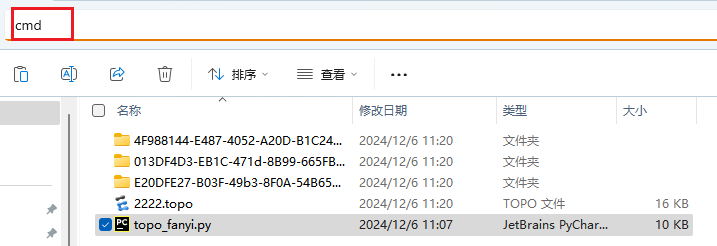

# ENSP---MobaXterm---Session---AutoCreator
本仓库存储的项目旨在通过Python脚本实现自动创建连接到ENSP模拟器的MobaXterm会话文件。这一功能极大地提高了在网络环境模拟和测试场景下，建立连接的效率，避免了手动创建会话的繁琐过程。
演示视频：【【项目示例】Python脚本实现自动创建连接ENSP的MobaXterm会话】 https://www.bilibili.com/video/BV1SkqHY5E4H/?share_source=copy_web&vd_source=59e023c51012d18c6921a150c80bc134
## 解答
### 我该如何下载脚本
1.0.0版本下载链接：https://github.com/honor260703/ENSP---MobaXterm---Session---AutoCreator/releases/download/v1.0.0/V1.0.0.zip

### 这个脚本能干什么？有什么意义？

通过运行此脚本，能够生成一个名为“MobaXterm Sessions.mxtsessions”的MobaXterm会话文件，进而实现批量创建连接至ENSP模拟器的Telnet会话，无需手动创建。此外，该脚本还可生成名为“设备信息表”的xlsx表格，表格内容包含设备名、设备端口号、设备MAC地址、SN码以及设备ID。 从第三方远程连接工具连接到网络设备的CLI（命令行界面）之后，能够更直观地查看设备输出信息，如下所示：


### Mobaxterm连接后回车显示M如何解决？ 

在MobaXterm程序所在的路径下找到MobaXterm.ini文件并新增代码即可解决问题

```
[MottyOptions]
LocalEcho=1
LocalEdit=1
```


### 我该怎么使用这个项目？

很简单，你只需要把topo_messages.py脚本下载下来并放到保存的拓扑文件夹内，再执行一下脚本就行了。

## 使用示范

**注：需要Python环境**

将topo_messages.py脚本（原名topo_fanyi.py，我不想重新截图了）移动至保存的拓扑文件夹内，并在地址栏内输入cmd（或者你也可以通过VS Studio code、Pycharm等方式直接运行脚本）并回车打开命令提示符



执行命令python topo_messages.py后，会在当前拓扑文件夹内生成表格文件和MobaXterm会话文件。


打开MobaXterm程序，如下图所示，右键User session选择Import session from file选项


选择生成的MobaXterm会话文件


Yes


